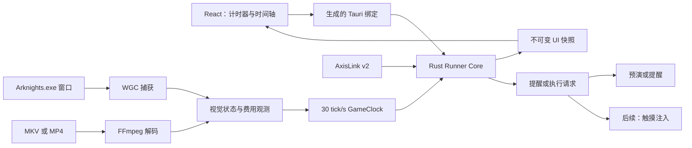

# 产品架构

## 技术基线

- Tauri 2、React、TypeScript、Vite、Rust 2024。
- 根目录为单个 React 应用，`src-tauri/` 为唯一 Rust crate。
- npm 与 Cargo lockfile 固定依赖；Node 和 Rust 工具链固定具体版本。
- React 使用原生 state/useReducer、普通 CSS 和 SVG。

## 运行结构

## 权威边界

- Rust 持有游戏时钟、关卡状态、轴、调度游标和已触发集合。
- React 只持有展示状态与尚未提交的表单输入。
- AxisLink JSON Schema 是跨仓库协议的唯一规范源，并生成 Rust/TypeScript 类型。
- Tauri 命令以 Rust 类型为源生成 TypeScript 绑定。
- 同帧事件按 `frame`、创建序号、稳定 ID 排序。
- 轴的期望关卡与 OCR 或手动确认的观测关卡分别持有；不一致时跳过并消费已到期调度项，禁止恢复后补发。

## 监控链

- Runner 使用 `windows-capture` 提供的 Windows Graphics Capture 封装选择并捕获 `Arknights.exe` 窗口；CostBarRuler 仅作为公开行为基线，不作为运行时依赖。
- 捕获线程只保留最新帧，视觉线程输出带捕获单调时间、战斗状态、费用相位和可信度的不可变观测。
- 视觉识别在归一化的 1920×1080 参考坐标中采样费用条、速度键和暂停键，不渲染或保存完整游戏画面。
- 录屏使用 `ffprobe` 读取元数据并由 `ffmpeg` 解码为 30 Hz BGRA 帧，随后进入同一视觉与时钟状态机；离线结果只保存在内存。
- 关卡标题帧使用 Windows OCR 同时读取代码与中文名，并与固定版本的内置关卡目录匹配；地图按需下载到缓存，不渲染到界面。
- 主题、费用周期分母和游戏 UI 比例属于应用设置，可以持久化；AxisLink 草稿与录屏分析结果不得自动保存。

## 时钟路径

两条高层时钟路径保持独立，避免把不同的数据完整性和回溯语义藏在模式开关中：

- `ProxyClock`：仅接受 1×、2×、暂停和满费外推；出现意外 0.2×或未知状态即停止执行。
- `HumanClock`：逐帧识别 1×、2×、暂停、0.2×、部署和方向调整；无法判断时保留帧范围，后续锚点可以修正尚未导出的操作点。

两者只共享捕获时间戳换算、定点帧累加等无状态基础函数，不共享可变状态或触发历史。

实机阶段以 WGC 捕获时间戳为单调时间。首次可信运行观测建立 F0；费用条可见时负责锚定，满费时按当前可信速度外推，暂停时冻结。未知、过期或窗口失效的观测不会推动权威时钟。稳定识别到离关后时钟归零并回到等待，当前轴保持不变。

费用逻辑秒分母是费用周期与显示配置，不改变 30 Hz 权威游戏帧。若分母为 60，则 F60 显示为 `00:01:00/60`，其现实持续时间仍为 2 秒；AxisLink 中的事件帧保持 F60。

## 执行策略

不调用游戏内部函数。代理执行使用 Windows `InjectTouchInput`，以显式屏幕坐标模拟触摸且不依赖实体鼠标位置。

- 暂停部署：保持暂停，完成干员卡拖拽、落点与朝向，再确认结果。
- 暂停选中：参考 AFA 提交 `d69d6cfdf35ff06c17d031d0a7c9b2b9c84d97e6` 的 `ActionPauseSelect`、`ActionPauseSkill` 和 `ActionPauseRetreat`，在暂停边界内短暂接触运行状态、触摸目标并恢复暂停，再发送技能或撤退键。
- 每个事务记录暂停开始、操作、暂停结束的主机时间与同一游戏帧，供日志和视频剪辑使用。
- 代理执行前从窗口帧唯一匹配部署栏头像；地图格子经正视/侧视投影转换为客户区坐标。同帧事件按轴顺序串行，任一步失败终止批次。
- F12 急停、窗口失焦、尺寸变化、时钟或关卡不可信会取消活动触点并关闭代理执行，已错过事件不得补发。

## 安全边界

- 默认 dry-run，代理执行需要显式启用。
- 游戏窗口必须在前台且不被 Runner 覆盖；窗口变化、输入失败、时钟不确定或急停均终止事务。
- 不读取或修改游戏内存，不注入代码，不绕过反作弊，不解析网络协议。
