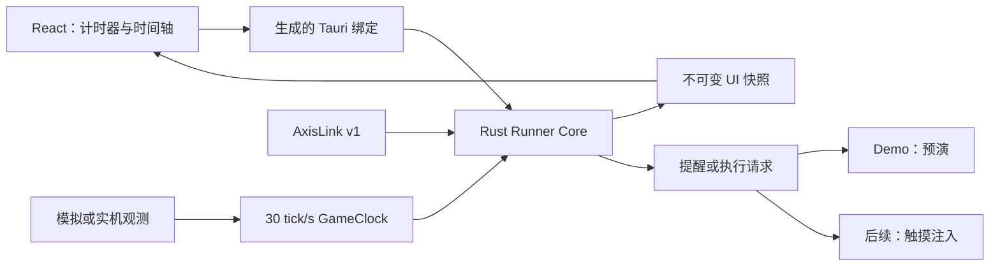

# 产品架构

## 技术基线

- Tauri 2、React、TypeScript、Vite、Rust 2024。
- 根目录为单个 React 应用，`src-tauri/` 为唯一 Rust crate。
- npm 与 Cargo lockfile 固定依赖；Node 和 Rust 工具链固定具体版本。
- React 使用原生 state/useReducer、普通 CSS 和 SVG。

## 运行结构

## 权威边界

- Rust 持有游戏时钟、关卡状态、轴、调度游标和已触发集合。
- React 只持有展示状态与尚未提交的表单输入。
- AxisLink JSON Schema 是跨仓库协议的唯一规范源，并生成 Rust/TypeScript 类型。
- Tauri 命令以 Rust 类型为源生成 TypeScript 绑定。
- 同帧事件按 `frame`、创建序号、稳定 ID 排序。

## 时钟路径

两条高层时钟路径保持独立，避免把不同的数据完整性和回溯语义藏在模式开关中：

- `ProxyClock`：仅接受 1×、2×、暂停和满费外推；出现意外 0.2×或未知状态即停止执行。
- `HumanClock`：逐帧识别 1×、2×、暂停、0.2×、部署和方向调整；无法判断时保留帧范围，后续锚点可以修正尚未导出的操作点。

两者只共享捕获时间戳换算、定点帧累加等无状态基础函数，不共享可变状态或触发历史。

实机阶段以 WGC 捕获时间戳为单调时间。费用条可见时负责锚定；满费时按当前速度外推。WebSocket `SkipToLatest` 可用于代理模式，高精度人类模式使用不丢帧的原始帧流或 Runner 自有 WGC。

## 执行策略

不调用游戏内部函数。后续使用 Windows `InjectTouchInput`，以显式屏幕坐标模拟触摸且不依赖实体鼠标位置。

- 暂停部署：保持暂停，完成干员卡拖拽、落点与朝向，再确认结果。
- 暂停选中：参考 AFA 提交 `d69d6cfdf35ff06c17d031d0a7c9b2b9c84d97e6` 的 `ActionPauseSelect`、`ActionPauseSkill` 和 `ActionPauseRetreat`，在暂停边界内短暂接触运行状态、触摸目标并恢复暂停，再发送技能或撤退键。
- 每个事务记录暂停开始、操作、暂停结束的主机时间与同一游戏帧，供日志和视频剪辑使用。

## 安全边界

- 默认 dry-run，真实执行需要显式武装。
- 游戏窗口必须在前台且不被 Runner 覆盖；窗口变化、输入失败、时钟不确定或急停均终止事务。
- 不读取或修改游戏内存，不注入代码，不绕过反作弊，不解析网络协议。
