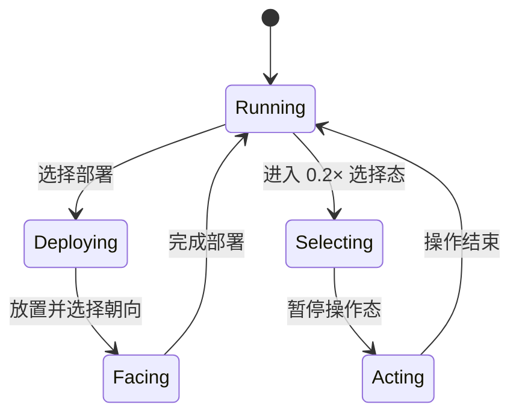

# 录屏操作候选设计

## 数据边界

AxisLink v2 不增加候选或录屏字段。录屏分析结果是会话内数据：

```text
SourceTimestamp = raw_pts + time_base
MappedGameTime = inclusive game_frame range + trusted
AnalysisCandidate = source interval + game interval + optional kind
                    + optional operator/tile/direction
                    + evidence + confidence + unconfirmed_fields
ConfirmedOperation = manually chosen frame + complete AxisLink semantics
```

原始 PTS 使用视频流 time base 中的整数保存；纳秒值只用于排序和时钟输入。读取 `best_effort_timestamp` 缺失、时间基无效、PTS 倒退或换算溢出时，不用平均帧率补造时间，而是建立断点并标记映射不可信。

## 解码与时间映射

`ffprobe` 提供视频流 `time_base` 及逐帧 `best_effort_timestamp`。FFmpeg 按原展示帧序解码 BGRA，不使用 `fps=30` 滤镜重采样。第 N 个解码帧只与第 N 个有效逐帧记录配对；数量不一致视为缺失片段。

每个源观测送入可信人类时钟后得到 30 Hz 游戏帧及误差范围。暂停状态可以有递增的源 PTS 和不变的游戏帧。丢帧、费用锚点修正或其他不确定性通过闭区间表达；后续人工校对可在区间附近选择最终帧。

## 候选提取

提取器只消费连续、可信且置信度达到阈值的观测，并先对同类状态做至少两帧去抖：



- `DeployingOperator → AdjustingOperatorFacing → Running/Paused` 生成 `deploy` 候选。该证据只能确定部署手势，不能确定干员、格子或方向。
- `PointTwoXRunning → Paused → OneXRunning/TwoXRunning` 生成种类未知候选。现有视觉证据不能区分技能、撤退或其他选中操作，禁止把它标成技能或撤退。
- 状态抖动不生成候选。手势在断点前被截断时，可以生成低置信、种类未知候选，供人工决定删除或校对。

候选按照关卡区段、源起始 PTS 和生成序号稳定排序。相同证据区间不重复生成多个候选。

## 人工确认

人工确认可以修正候选种类和最终游戏帧。三类操作都必须提供合法格子；部署还必须提供 `char_` 开头的干员 ID 和四向方向。技能、撤退不得携带部署专用的干员或方向字段。确认函数成功返回新的只读结果，不原地改写分析候选。

UI 和轴合并在后续集成中消费 `ConfirmedOperation`。存在任何 `unconfirmed_fields` 的候选不能直接转换、导出或代理。

## 夹具与验收

合成 JSON 夹具记录源 PTS/time base、关卡区段、游戏帧范围、可信标志、战斗状态和观测置信度。它用于稳定复现状态机和时间边界，不替代真实录屏。实机验收需要补充官方 PC 客户端在不同帧率、暂停、缺帧和多关卡区段下的部署、技能、撤退样本，并人工标注操作区间。
